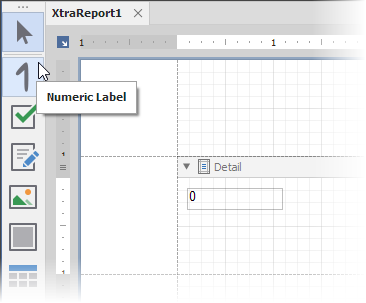

<!-- default badges list -->

<!-- default badges end -->
# Add a Custom Control to the End-User Report Designer Toolbox (WinForms)

This example demonstrates how to add a [custom numeric label control](https://docs.devexpress.com/XtraReports/3307) to the [End-User Report Designer](https://docs.devexpress.com/XtraReports/10715) Toolbox in a WinForms application.

## Files to Look At

- [NumericLabel.cs](CS/NumericLabel.cs) ([NumericLabel.vb](VB/NumericLabel.vb))
- [Form1.cs](CS/Form1.cs) ([Form1.vb](VB/Form1.vb))

## Documentation

- [Add a Custom Control to the End-User Report Designer Toolbox (WinForms)](https://docs.devexpress.com/XtraReports/7546/winforms-reporting/end-user-report-designer-for-winforms/api-and-customization/add-custom-control-to-the-end-user-report-designers-toolbox?v=21.2).

## More Examples

- [How to Create a Custom DevExpress Report Control - Swiss QR Bill Implementation](https://github.com/DevExpress-Examples/Reporting-Custom-Controls)
- [How to use custom controls for editing report content in Print Preview](https://github.com/DevExpress-Examples/Reporting_how-to-use-custom-controls-for-editing-report-content-in-print-preview-t453603)
